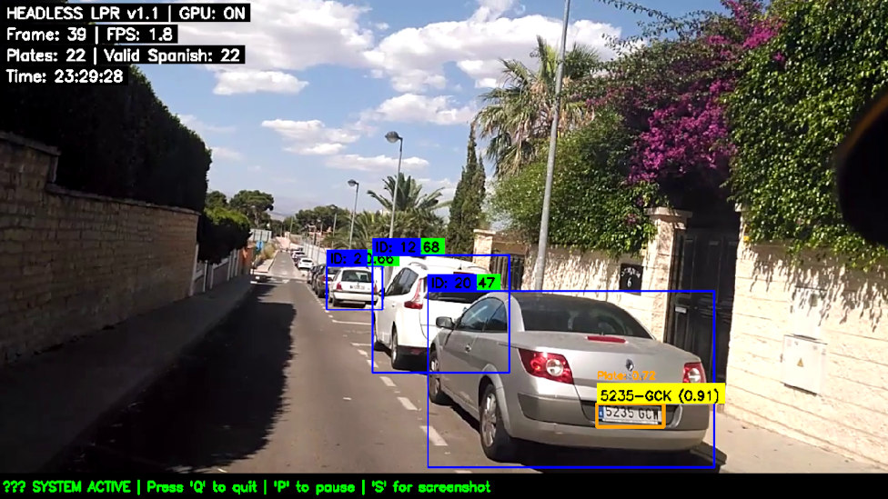

# Spanish License Plate Recognition with YOLOv8 & GPU Acceleration

**Production-ready Spanish License Plate Recognition system v1.1** with GPU acceleration, temporal voting, and fixed duplicate plate reporting.



## ✨ Features v1.1

- **✅ Fixed Duplicate Plate Reporting**: Unique plates report now shows exactly 30 entries (one per ground truth plate)
- **✅ Ground-Truth-First Matching**: Improved matching algorithm prevents duplicate assignments
- **✅ Hungarian-Style Assignment**: Each OCR result assigned to only one ground truth plate
- **✅ Temporal Voting**: Consolidates multiple detections into single high-confidence results
- **✅ Spanish Plate Validation**: Specialized processing for Spanish plate formats (####-LLL, LL-####-LL)
- **✅ GPU Acceleration**: CUDA-enabled processing for real-time performance
- **✅ Bot-SORT Tracking**: Multi-object tracking for vehicle continuity
- **✅ PaddleOCR Integration**: Improved OCR accuracy with Spanish-specific optimizations

## 📊 Performance Metrics v1.1 (NVIDIA GeForce GTX 940M 2Gb)

| Metric | Value |
|--------|-------|
| **Frames Processed** | 2251 |
| **Average FPS** | 6.43 |
| **Plates Detected** | 773 |
| **Valid Spanish Plates** | 773 (100%) |
| **Unique Cars Detected** | 41 |
| **Ground Truth Plates** | 30 |
| **Plates Detected** | 28/30 (93.3%) |
| **Exact Matches** | 28/28 (100%) |
| **Digit Accuracy** | 196/196 (100%) |
| **Processing Time** | 5:49 minutes |

## 🚀 Quick Start

### 1. Installation
```bash
# Clone repository
git clone https://github.com/alexdominguez09/numberplate_yolo8.git
cd numberplate_yolo8

# Install dependencies
pip install -r requirements-dev.txt

```

### 2. Model Download
Create `download_models.sh`:
```bash
#!/bin/bash
# Download YOLOv8n model
wget https://github.com/ultralytics/assets/releases/download/v8.0.0/yolov8n.pt

# Create models directory
mkdir -p models

echo "and place it in the models/ directory"
```

### 3. Usage Examples
```bash
# Headless mode with ground truth comparison (recommended)
python main_spanish_headless_v1.1.py --video out.mp4 --ground-truth numberplate_ground_truth.txt

# Headless mode with custom confidence threshold
python main_spanish_headless_v1.1.py --video out.mp4 --min-confidence 0.40 --max-frames 500

# Headless mode with display (for debugging)
python main_spanish_headless_v1.1.py --video out.mp4 --display --display-plate

# Generate comprehensive testing report
python generate_report.py

# Test YOLO models
python test_yolo_models.py
```

## 🛠️ System Architecture

1. **Vehicle Detection**: YOLOv8n (COCO-trained) for vehicle detection
2. **License Plate Detection**: Fine-tuned YOLO model for Spanish plates
3. **Spanish Plate Validation**: Custom preprocessing and character correction
4. **OCR Processing**: PaddleOCR with Spanish-specific optimizations
5. **Tracking**: SORT or Bot-SORT algorithm for vehicle continuity
6. **Visualization**: OpenCV-based real-time overlay

## 📁 File Structure v1.1
```
numberplate_yolo8/
├── main_spanish_headless_v1.1.py    # Main system v1.1 with duplicate fix
├── utils_spanish_fixed.py           # OCR utilities with PaddleOCR integration
├── generate_report.py               # PDF report generator v1.1
├── test_yolo_models.py              # YOLO model testing utility
├── requirements-dev.txt             # Dependencies
├── .gitignore                       # Git ignore rules
├── LICENSE                          # MIT License
└── README.md                        # This file
```

## 🔧 Configuration v1.1

### Command-Line Arguments

**main_spanish_headless_v1.1.py:**
- `--video, -v`: Path to input video file (required)
- `--output, -o`: Output CSV file path (default: results_spanish_headless.csv)
- `--plates-file, -pf`: Output text file with unique plates (default: unique_plates.txt)
- `--max-frames, -m`: Maximum frames to process (default: None for full video)
- `--ground-truth, -gt`: Path to ground truth text file (one plate per line)
- `--min-confidence, -mc`: Minimum OCR confidence to track (default: 0.40)
- `--display, -d`: Enable display window with cv2.imshow
- `--display-plate, -dp`: Display cropped license plate before OCR


## 📝 Spanish Plate Formats Supported
- **Current (2000+)**: `####-LLL` (e.g., `1234-ABC`)
- **Old (pre-2000)**: `LL-####-LL` (e.g., `AB-1234-AB`)
- **Provincial**: `L-####-LL` or `LL-####-L` (e.g., `M-1485-ZX`)
- **Character Restrictions**: No vowels (AEIOU), no Q

## 🤝 Contributing
Contributions are welcome! Please feel free to submit a Pull Request.

## 📄 License
This project is licensed under the MIT License - see the [LICENSE](LICENSE) file for details.

## 🙏 Acknowledgments
- Original Video-ANPR project: [sveyek/Video-ANPR](https://github.com/sveyek/Video-ANPR)
- YOLOv8 by Ultralytics
- Bot-SORT tracking algorithm
- PaddleOCR for text recognition
- OpenCV for computer vision processing
